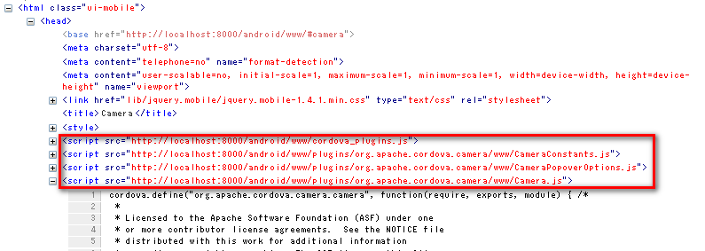

# Cordova 3.x 源码分析（2） -- cordova.js 概要

前提环境： 

**引用**

```
Platform: android 
Version: 3.4.0
```

**（1）cordova.js/cordova_plugins.js 文件** 

cordova.js 在创建 Android 工程的时候，是从 cordova 的 lib 目录下 Copy 到 platforms\android\assets\www\cordova.js 的。同时备份到 platforms\android\platform_www\cordova.js 

**引用**

	C:\Documents and Settings\RenSanNing\.cordova\lib\android\cordova\3.4.0\framework\assets\www\cordova.js


而 platforms\android\assets\www\cordova_plugins.js 是根据 plugins 文件夹的内容生成的。 

**（2）自己亲手生成 cordova.js** 

Cordova 是 OSS 的，所以可以通过源代码来生成 cordova.js 

a)下载源码   
目前稳定版是3.4.0，master 是3.5.0-dev。   
从 [https://github.com/apache/cordova-js/tree/3.4.x](https://github.com/apache/cordova-js/tree/3.4.x) 下载 cordova-js-3.4.x.zip 解压到 E:\cordova-js-3.4.x 

b)构建工具使用的是 Grunt，所以要先安装 grunt-cli 

**引用**

```
npm install -g grunt-cli
```

c)手动生成 

**引用**

```
cd E:\cordova-js-3.4.x 
npm install  --安装package.json中devDependencies定义的依赖包 
grunt        --运行 grunt
```

d)执行后多了2个文件夹 

node_modules 依赖包   
pkg   
  cordova.android.js   
  cordova.ios.js   
  ... 

其中 cordova.android.js 就是我们 Android 工程要用到的 cordova.js 了。 

**（3）cordova.js 的整体结构** 

从 E:\cordova-js-3.4.x\tasks\lib\bundle.js 可以看出 cordova.js 的整体结构是： 

Js **代码**

```
// Platform:  <platform>
// <commitId>
/* <license> */
;(function() {
var CORDOVA_JS_BUILD_LABEL = '<commitId>';
// src\scripts\require.js文件内容
// 各Module文件内容
window.cordova = require('cordova');
// src\scripts\bootstrap.js文件内容
})();
```

其中 Module 来自以下文件： 

- src\common\**.js
- src\android\**.js
- src\cordova.js

各文件输出形式： 

**引用**

```
// file: <fileName> 
<fileContents>
```

最终的 cordova.js： 

Js **代码** 

```
// Platform: android
// 3.4.0
/*
 License 省略
*/
;(function() {
var CORDOVA_JS_BUILD_LABEL = '3.4.0';
// file: src/scripts/require.js
//...
// file: src/cordova.js
define("cordova", function(require, exports, module) { /*...*/ }
// file: src/android/android/nativeapiprovider.js
define("cordova/android/nativeapiprovider", function(require, exports, module) { /*...*/ }
// file: src/android/android/promptbasednativeapi.js
define("cordova/android/promptbasednativeapi", function(require, exports, module) { /*...*/ }
// file: src/common/argscheck.js
define("cordova/argscheck", function(require, exports, module) { /*...*/ }
// file: src/common/base64.js
define("cordova/base64", function(require, exports, module) { /*...*/ }
// file: src/common/builder.js
define("cordova/builder", function(require, exports, module) { /*...*/ }
// file: src/common/channel.js
define("cordova/channel", function(require, exports, module) { /*...*/ }
// file: src/android/exec.js
define("cordova/exec", function(require, exports, module) { /*...*/ }
// file: src/common/exec/proxy.js
define("cordova/exec/proxy", function(require, exports, module) { /*...*/ }
// file: src/common/init.js
define("cordova/init", function(require, exports, module) { /*...*/ }
// file: src/common/modulemapper.js
define("cordova/modulemapper", function(require, exports, module) { /*...*/ }
// file: src/android/platform.js
define("cordova/platform", function(require, exports, module) { /*...*/ }
// file: src/android/plugin/android/app.js
define("cordova/plugin/android/app", function(require, exports, module) { /*...*/ }
// file: src/common/pluginloader.js
define("cordova/pluginloader", function(require, exports, module) { /*...*/ }
// file: src/common/urlutil.js
define("cordova/urlutil", function(require, exports, module) { /*...*/ }
// file: src/common/utils.js
define("cordova/utils", function(require, exports, module) { /*...*/ }
window.cordova = require('cordova');
// file: src/scripts/bootstrap.js
require('cordova/init');
})();
```

***define()的顺序是在 Grunt 的时候简单的按模块 ID 名升序排的，先后无所谓。   
***define 只是注册模块，不会调用其 factory。   
***在 index.html 通过<script type="text/javascript" src="cordova.js"></script>引入cordova.js 后：   

Js **代码**

```
// 加载cordova模块，赋给window.cordova
// require()第一次被调用，就开始调用其factory。
// factory中又包含了其他的require()，就形成了嵌套，直到最后所有module的factory被执行完。
window.cordova = require('cordova');  
// 加载Plugin代码等初期化处理
require('cordova/init');

```

（4）cordova.js 中个模块的说明 

平台相关的： 

- src/android/android/nativeapiprovider.js JS->Native 的具体交互形式
- src/android/android/promptbasednativeapi.js 通过 prompt()和 Native 交互（Android2.3 simulator 的 Bug）
- src/android/exec.js ****执行 JS->Native 交互
- src/android/platform.js ***bootstrap 处理
- src/android/plugin/android/app.js 清缓存、loadUrl、退出程序等

通用的： 

- src/common/argscheck.js 用于 plugin 中校验参数，比如 argscheck.checkArgs('fFO', 'Camera.getPicture', arguments); 参数应该是2个函数1个对象
- src/common/base64.js JS->Native 交互时对 ArrayBuffer 进行 uint8ToBase64（WebSockets 二进制流）
- src/common/builder.js 对象属性操作，比如把一个对象的属性 Merge 到另外一个对象
- src/common/channel.js ****控制事件调用
- src/common/exec/proxy.js 用于 Plugin 中往已经有的模块上添加方法
- src/common/init.js ****初期处理
- src/common/modulemapper.js ***把定义的模块 clobber 到一个对象，在初期化的时候会赋给window
- src/common/pluginloader.js ***加载所有 cordova_plugins.js 中定义的模块，执行完成后会触发 onPluginsReady
- src/common/urlutil.js 获取绝对 URL，InAppBrowser 中会用到
- src/common/utils.js 工具类

核心： 

- src/cordova.js ****事件的处理和回调，外部访问 cordova.js 的入口
- src/scripts/require.js  *****模块化系统
- src/scripts/bootstrap.js 启动处理（只调用了初期处理 require('cordova/init');），注意和 platform 的 bootstrap 处理不一样

**（5）cordova_plugins.js 的整体结构** 
 
Cordova 从3.0版本开始不再在 cordova.js 中包含各 plugin 的代码，而是采用 plugman 通过 CLI 生成 cordova_plugins.js 然后动态加载需要的 plugin。3.0之前的代码结构可以参考：[https://github.com/apache/cordova-js/tree/2.8.x](https://github.com/apache/cordova-js/tree/2.8.x) lib-<platform>/plugin/<platform> 

Js **代码**

```
cordova.define('cordova/plugin_list', function(require, exports, module) {
module.exports = [
    {
        "file": "plugins/org.apache.cordova.vibration/www/vibration.js",
        "id": "org.apache.cordova.vibration.notification",
        "merges": [
            "navigator.notification"
        ]
    },
    //.......
];
module.exports.metadata = 
// TOP OF METADATA
{
    "org.apache.cordova.vibration": "0.3.7",
    // ....
}
// BOTTOM OF METADATA
});
```


其实也是 define 了一个 ID 为“cordova/plugin_list”的模块，在初期化的时候动态加载到 head 里的。Cordova 提供的 Native API 的 js 也是一样的，可以启动浏览器调试看 HTM L的 Head 部分：



后续从四个方面继续分析 cordova.js 中一些核心代码： 

[（1）cordova.js 模块系统 require/define](http://rensanning.iteye.com/blog/2047324) 

- src/scripts/require.js 自定义的模块系统

[（2）cordova.js 事件通道 pub/sub](http://rensanning.iteye.com/blog/2051889) 

- src/common/channel.js 发布/订阅模式的事件通道

[（3）cordova.js 导入、初始化、启动、加载插件](http://rensanning.iteye.com/blog/2052142) 

- src/cordova.js 事件的处理和回调，外部访问 cordova.js 的入口
- src/common/init.js 初始化处理
- src/android/platform.js 平台启动处理
- src/common/pluginloader.js 加载所有 cordova_plugins.js 中定义的模块，执行完成后会触发 onPluginsReady

[（4）cordova.js 本地交互 JS<->Native](http://rensanning.iteye.com/blog/2054049) 

- src/android/android/nativeapiprovider.js JS->Native 的具体交互形式
- src/android/android/promptbasednativeapi.js 通过 prompt()和 Native 交互（Android2.3 simulator 的 Bug）
- src/android/exec.js 执行 JS->Native 交互

剩下的代码就不分析了： 

**引用**

```
src/android/plugin/android/app.js 
src/common/argscheck.js 
src/common/base64.js 
src/common/builder.js 
src/common/exec/proxy.js 
src/common/modulemapper.js 
src/common/urlutil.js 
src/common/utils.js
```


下载带注释的 cordova.js：[这里](http://dl.iteye.com/topics/download/d0f0b293-89c6-3931-8139-4bcaebe5e52f) 

参考：   
[http://www.cnblogs.com/linjisong/tag/PhoneGap/](http://www.cnblogs.com/linjisong/tag/PhoneGap/)

