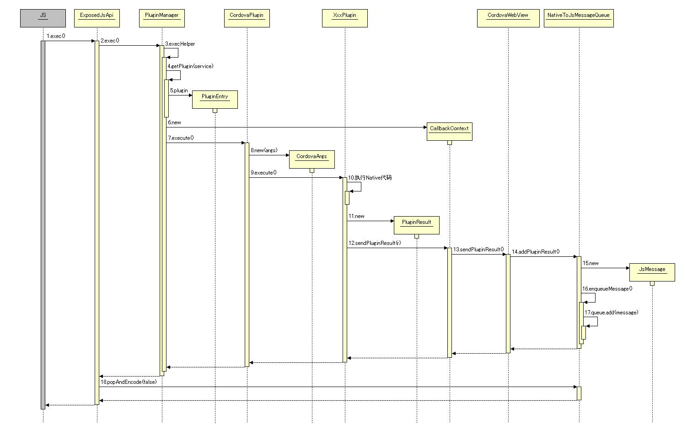

# Cordova 3.x 源码分析（7） -- CordovaLib 概要

在 [http://rensanning.iteye.com/blog/2020843](http://rensanning.iteye.com/blog/2020843) 已经介绍过通过 Cordova CLI 创建 Cordova 工程。 

Cordova 生成的 Android 工程主要来自于以下目录： 

**引用**

    C:\Documents and Settings\RenSanNing\.cordova\lib\android\cordova\3.4.0\bin\templates\project

其中所用的 CordovaLib 来自于以下目录： 

**引用**

    C:\Documents and Settings\RenSanNing\.cordova\lib\android\cordova\3.4.0\framework


从 Cordova 3.3.0以后，方便调试，CordovaLib 的提供形式从 jar 文件变成了 Android Library。   
参考：[https://issues.apache.org/jira/browse/CB-5232](https://issues.apache.org/jira/browse/CB-5232) 

CordovaLib 中的代码主要包括：   
com.squareup.okhttp： 导入 HTTP+SPDY 客户端的 [OkHTTP](https://github.com/square/okhttp)，获取网络资源。   
org.apache.cordova： 剩下的所有代码都在该包下（以前还有过 org.apache.cordova.api ）


**基础类：**

- CordovaInterface.java CordovaActivity 的接口（使 plugin 不依赖 CordovaLib 更独立）
- CordovaActivity.java  应用的主 Activity 需要继承自该类。
- Config.java 解析 config.xml
- Whitelist.java 白名单列表
- LinearLayoutSoftKeyboardDetect.java 布局（检测软键盘）

**Webview 相关：** 

- CordovaWebView.java 核心 Webview 类
- CordovaWebViewClient.java 捕获 Webview 事件回调(2.x 版本没有 WebResourceResponse)
- IceCreamCordovaWebViewClient.java 在3.x、4.x 版本中拦截网页中资源请求，比如 js,css,img,ajax
- CordovaChromeClient.java 捕获  JavaScript 事件，其中 onJsPrompt() 对应2.3模拟器的交互 Bug
- AuthenticationToken.java Http 请求的认证
- ScrollEvent.java 回传 onScrollChanged 事件坐标
- CordovaResourceApi.java 获取资源

**Plugin 相关：** 

- PluginManager.java　插件管理
- PluginEntry.java　插件实体
- CordovaPlugin.java Plugin 的基类
- CordovaArgs.java 接收 JSON 参数
- PluginResult.java  执行结果
- CallbackContext.java 通过 sendPluginResult 回传结果
- ExposedJsApi.java JS  桥接
- NativeToJsMessageQueue.java 回传结果的消息队列

**无用类：** 

- DirectoryManager.java 3.1开始@Deprecated，移动了 file 的 plugin 中
- ExifHelper.java 3.1开始@Deprecated，移动了 camera 的 plugin 中
- FileHelper.java 3.1开始@Deprecated，移动了 camera 和 file 的 plugin 中
- JSONUtils.java 3.1开始@Deprecated，无用类
- DroidGap.java  2.7开始@Deprecated，DroidGap.java 名字太难听，改成了CordovaActivity。参考：[https://issues.apache.org/jira/browse/CB-2657](https://issues.apache.org/jira/browse/CB-2657)

****这些文件中有些 Java 文件已经不再建议使用，在未来的某个版本将会被删除！！！ 

**其他：** 

- App.java  清缓存、loadUrl、退出程序等的 plugin（以后会被单做成一个 plugin）
- LOG.java 日志 util

Android WebView 由于版本的问题，存在很多局限和 Bug，而 Android 4.4开始默认搭载 Google 的最新渲染引擎 Blink/Chromium。 

①[ChromeView](https://github.com/pwnall/chromeview) 使用 Chromium 代替 WebView 的一个实现，也有 [cordova-android-chromeview](https://github.com/thedracle/cordova-android-chromeview)，不过更新比较慢。   
②[Intel Crosswalk](https://crosswalk-project.org/) 构建于 Chromium 之上，提供更加丰富的功能。同时提供了 [crosswalk-cordova-android](https://github.com/crosswalk-project/crosswalk-cordova-android)。 

使用以上2中解决方案都能改善 Webview 的问题，但是同时你的 apk 文件的大小将增加20 M左右。 

**程序入口：** 

Java **代码**

```
public class CordovaSample extends CordovaActivity 
{
    @Override
    public void onCreate(Bundle savedInstanceState)
    {
        // 读取config.xml，设置UI
        super.onCreate(savedInstanceState);
        // 初始化Webview后添加到ＵＩ中
        super.init();
        // 加载首页file:///android_asset/www/index.html
        // 其中index.html是在config.xml中配置的。
        super.loadUrl(Config.getStartUrl());
    }
}
```

**启动序列图：** 


**Plugin 序列图：**



